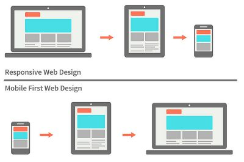

# estructura
    selector{
        propiedad:valor;
        propiedad:valor;
        propiedad:valor;
    }
# selectores
## universal
    *{

    }
## de etiqueta
    p{

    }
    
## de objeto
    nombreDelObjeto{

    } 
    
## de clase
    .clase{

    } => css
    <h3 class = "nombre de la clase"> </h3> => html
    
## descendente
    .noticia h2{

    } => css
    <ul id = "noticia">
        <h2> nciwontexto modificadoisoenf </h2>
    </ul>
    
## convinada
    h2.noticia => css
    <h2 class = "noticia"> texto modificado</h2>
    
## id
    #nombre{

    } => css
    <h3 id = nombre> texto modificado </h3>

# Estilos
## Tipografia
    - color: rojo                 => se le pone un color a la tipografia
    - font-famili: tipografia     => se le pone una tipografia al texto
    - font-size: tamaño px        => se le agrega un tamaño a la tipografia
    - font-style: italica         => tipografia en cursiba
    - font-weight: bold           => tipografia en negrita
    - text-aling : left           => alineacion left(derecha) right(izquierda) center(centrado) justify(jutificado)
    - text-decoration : none      => agrega un subrallado con underline o un tachado con line-through
    - text-transforme: none       => uppercase(todo en mayuscula), lowercase(todo en minusculas)
    - line-height: tamaño         => distancia entre parrafos
## Colores
    - color: nombre                           => aplicar colores con nombre 
    - color: porValorHexa                     => se menciona los 6 digitos hexadecimal
    - color: rgb(rojo,verde,azul)             => se menciona por rgb
    - color: rgba(rojo,verde,azul,opacidad)   => se le agrega la opacidad al rgb
## Fodos
    - background-color: color               => aplica un fonde de un color determinado
    - background-image: url(ubicacion)      => se agrega una imange de fondo
    - backgroud-repea: repeat               => se repite indefinidamente  no-repeat(no repite) y el repeat-y/repeat-x(se repite segun un eje)
    - background-position: center botton    => define la posicion de la imagen
    - background-attachment: scroll         => scroll(baja segun la pagina) fixed (queda fija)
    - background-size: contain              => tamaño de la imagen contein(que entre la imagen) cover(ocupe toda la pagina )

## De Bloques
    - display: inline              => 
        cambiar la dispocicion del elemento, block (comportamiento en bloque) inline-block (comportamiento semi-bloque) inline  (comportamiento en linea) none(oculta el elemento)
    - width: valor px               => se aplica un ancho a bloque
    - height: valor px              => se le aplica un alto al bloque
    - padding:  valor px            => se le aplica un espacion de separacion a los costados
    - padding-top: valor px         => se le aplica un espacio al costado superior
    - padding-right: valor px       => se le aplica un espacio al costado lateral derecha
    - padding-bottom: valor px      => se le aplica un espacio al costado inferior
    - padding-left: valor px        => se le aplica un espacio al costado lateral izquierdo
    - border-width: valor px        => se le aplica una anchura al borde
    - border-style: valor           => 
        el tipo de linea que se le aplica al borde solid (continua), dashed(discontinua) dotted(de puntos) double (doble linea continua)
    - border-color: color           => le aplica un color a la linea
    - border-radius: valor px       => redondea el borde 
    - margin: valor px              => le aplica margenes a la caja
    - margin-top: valor px          => se le aplica un margenes al costado superior
    - margin-right: valor px        => se le aplica un margenes al costado lateral derecha
    - margin-bottom: valor px       => se le aplica un margenes al costado inferior
    - margin: left: valor px        => se le aplica un margenes al costado lateral izquierdo
    - box-sizing: border-box        => fina los valores de alto y ancho del width y height
    - 
## Otros comandos
    - opacity: valor               => se le agrega transparencia

# tipos de medida
## medida relativa
son aquellas que se modifican segun el contexto alguns ejemplos son:
    % (porsentaje)
    vw (viewport-width)
    vh (viewport-height)
## medidas absolutas
son aquella que no se modifican selgun el contexto algunos ejemplos son:
    px (pixel)

# Media queries
### Es una regla de estilo para que nuestra pagina se vea bien en todas las resoluciones, que se define al final del archivo css
## Estructura
    @media(){

    }
    min-width: x px => como minimo
    max-width x px  => como maximo
    and (orientation: ) => si se define una orientacion portrait o landscape
## tipos de forma
mobile first: se empiza por el formato de celular y se va adaptando al modelo de PC (el ma recomendado)
mobile last:  se empieza por el formato de PC a la version de celular 

## Breakpoints
Son los puntos recomendados en los cuales hacer un Media queries

# Normalize
## libreria de estilos para web. descarga: 

# flex
## Estructura basica
    .contenedor{
        displey: flex => hace que los elementos sean flex
        flex-wrap: wrap => matener tamaño de los elementos
    }
## Ejes
    flex-direction: row => eje principal el ancho de izquiera a derecha
    flex-direction: column => eje principal el largo de arriba a abajo
    flex-direction: row-reverse => eje principal el ancho de derecha a izquiera
    flex-direction: column-reverse => eje principal el ancho de abajo a arriba
### Manejo de los ejes
#### Eje main (eje X)
    justify-content: flex-start     => valor por defecto
    justify-content: flex-end       => envia los objetos al final del axis
    justify-content: center         => centra los elementos
    justify-content: space-between  => cepara de manera uniforme los objetos
    justify-content: space-around   => cepara de manera uniforme los objetos con separacion al principio y al final

#### Cross (eje y)
    align-items: stretch        => se estiran para acabar todo el contenedor
    align-items: flex-start     => se alinean al inicio del cross
    align-items: flex-end       => se ubican al final de cross
    align-items: center         => se ubican en el centro
    align-items: baseline       => Muestra elementos en la línea base del contenedor (anulana lign-items )
    align-self: stretch         => se estiran para acabar todo el contenedor (anulana lign-items )
    align-self: flex-start      => se alinean al inicio del cross (anulana lign-items )
    align-self: flex-end        => se ubican al final de cross (anulana lign-items )
    align-self: center          => se ubican en el centro (anulana lign-items )
    align-self: baseline        => Muestra elementos en la línea base del contenedor (anulana lign-items )

## otros
    flew-flow: <flex-direction> <flex-wrap> => convina los dos por ejemplo flew-flow: column warp
    order: valor => mueve el elemto al valor pos o neg que se le indeque
    flex-grow: valor => agranda un elemento segun el valor que se le indique

# Agregar iconos
1. entrar a la pagina de font awesome 
 

2. copiar etiqueta del kit
``

3. 