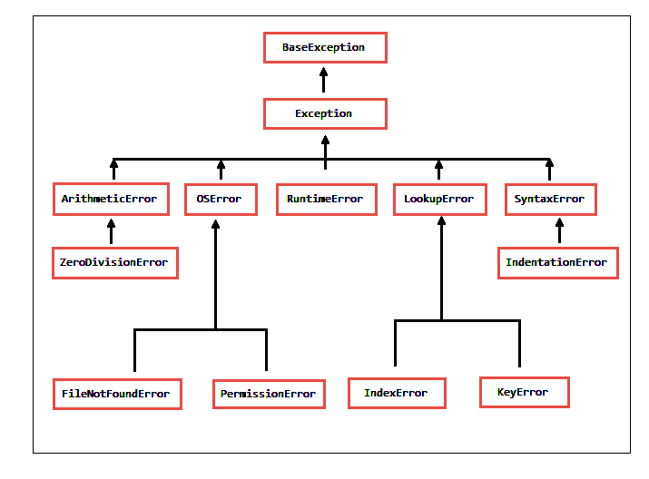

<div id = "indice"> <!----- Inicio de indice ------->

# Indice
1. 
|[Funciones](#funciones) |
|:-------------------------:|
|[Varios](#funciones-varios)|
|[Listas](#funciones-listas)|
|[Set](#funciones-set)|
|[Diccionarios](#funciones-diccionarios)|
   
2. 
|[Clase](#clase) |
|:-------------------------:|
|[Estructura](#clase-estructura)|
|[Clases Hijas](#clase-hijas)|
|[Clases Abstractas](#clase-abstractas)|
|[Funciones de Clases](#clase-funciones)|
   
3. 
|[Definiciones](#definiciones) |
|:-------------------------:|
|[Clases](#definiciones-clases)|
|[Variables](#definiciones-variables)|
|[Constante](#definiciones-constante)|
   
4. 
|[sobrecarga](#sobrecarga) |
|:-------------------------:|
|[¿Que es?](#sobrecarga-que-es)|
|[Funcion](#sobrecarga-funcion)|
  
5. 
|[Polimorfismo](#polimorfismo) |
|:-------------------------:|
|[¿Que es?](#polimorfismo-que-es)|
|[Metodos](#polimorfismo-metodos)|
  
6. 
|[Errores](#errores) |
|:-------------------------:|
|[Estructura](#errores-estructura)|
|[Tipo](#errores-tipo)|

</div> <!----- Fin de indice ------->
<div id = "funciones"> <!----- Inicio de funciones ------->

# Funciones

<div id = "funciones-varios"> <!----- Inicio de varios ------->

## Varios 
| Codigo                |                          Explicacion                    |
|:---------------------:|---------------------------------------------------------|
| `print("texto")`      | Muestra en cosola el texto
| `input("texto")`      | Muestra por consola el texto y espera resibir un valor
|`id(variable)`         | Ubicacion de memoria de la variable
|`int(variable)`        | Combierte la variable en int
|`float(variable)`      | Combierte la variable en float
|`type(variable)`       | El tipo de la variable
|`#`                    | Comentario
|`__name__`             | Muestra la ubicacion de donde se utiliza el codigo
|`del variable`         | Elimina el objeto

</div> <!----- Fin de varios ------->
<div id = "funciones-listas"> <!----- Inicio de listas ------->

## Funciones para listas
| Codigo                            |                       Explicacion                                |
|:---------------------------------:|------------------------------------------------------------------|
|`len(lista)`                       | Cantidad de elementos dentro de la lista
|`lista[valorInicial : valorFinal]` | Toma los valores entre el valorInicial y el valorFinal sin incluirlos
|`lista.append(valor)`              | Agrega un elemento al final de la lista
|`lista.insert(indice,valor)`       | Agrega un elemento en un indice especifico de la lista
|`lista.romeve(valor)`              | Remueve el valor de la lista
|`lista.pop()`                      | Elimina el ultimo valor de la lista
|`del lista[indice]`                | Elimina un elemento de la lista por indice
|`lista.clear()`                    | Elimina todos los valores de la lista
|`list(tupla)`                      | Convierte la tupla en una lista
|`tuple(lista)`                     | Convierte la lista en tupla

</div> <!----- Fin de listas ------->
<div id = "funciones-set"> <!----- Inicio de set ------->


## Funciones para set
| Codigo                |               Explicacion                     |
|:---------------------:|-----------------------------------------------|
|`len(set)`             | Cantidad de elementos
|`valor in set`         | Si el valor esta en el set 
|`set.add(valor)`       | Agrega valor en el set
|`set.remove(valor)`    | Elimina valor del sat 
|`set.discard(valor)`   | Elimina valor del set (de no estar no arroja error)
|`set.clear()`          | Elimina todos los valores dentro de set
|`del set`              | Elimina el set

</div> <!----- Fin de set ------->
<div id = "funciones-diccionarios"> <!----- Inicio de diccionarios ------->

## Funciones para diccionarios
| Codigo                                      |             Explicacion                     |
|:-------------------------------------------:|---------------------------------------------|
|`len(dicc)`                                  | Tamaño de diccionario
|`dicc[key]`                                  | Acceder a la definicion de la key
|`dicc.get(key)`                              | Acceder a la definicion de la key
|`for key,definicion in dicc.items()`         | Recorre un diccionario con las llaves y las definiciones
|`for key,definicion in dicc.key()`           | Recorre un diccionario con las llaves
|`for key,definicion in dicc.values()`        | Recorre un diccionario con  las definiciones 
|`key in dicc `                               | Si la key esta en el diccionario
|`dicc["nueva llave"] = "nueva definicion`    | Agrega un nuevo elemento al diccionario
|`dicc.pop(key)`                              | Elimina un elemento del diccionario
|`dicc.clear()`                               | Elimina todos los valores del diccionario
|`del dicc`                                   | Elimina el diccionario

</div> <!----- Fin de diccionarios ------->
</div> <!----- Fin de funciones ------->

<div id = "clase"> <!----- Inicio de clase ------->

# Funcion y estructuras de la clase

<div id = "clase-estructura"> <!----- Inicio de estructura ------->

## Estructura de clases
La clase es un molde para la creacion ya bien de objetos o de clases "hijas" que heredaran toda la estructura de la base
```
class Persona
    def __init__(self,nombre,apellido):     |
    self.nombre =  nombre                    > contructor de clase
    self.apellido =  apellido               |
    self._nombre1 = nombre                   => variable la cual no se puede modificar

    def nombreDelMetodo(self):                  |
    metodo                                       > creacion de metodos en clase
```

</div> <!----- Fin de estructura ------->
<div id = "clase-hijas"> <!----- Inicio de hijas ------->

## Clase hijas
Son clases provenientes de otras clase ya exixtente, pueden crearse a partir de una o varias clases
~~~
class Empleado(Persona):                       => herencia de una clase
    def __init__(self,nombre,apellido,sueldo):   |
        super().__init__(nombre,apellido)         > se inicializa la nueva variable y con super las 
        self.sueldo = sueldo                     | variables del "padre"
    
class ClaseHija(ClaseHerdada1, ClaseHeredada2): => herencia de varias clases
    def ____init__(self,): 
        ClaseHerdada1.__init__()       => se inicializa la nueva variable y con el nombre de la 
        ClaseHeredada2.__init__()         herencia las variables del "padre"
~~~

</div> <!----- Fin de hijas ------->
<div id = "clase-abstractas"> <!----- Inicio de abstractas ------->

## Clases Abstractas
Es una clase que no admite que se cren objetos a partir de ella. Es meramente de herencia
~~~
from abc import ABC,abstractmethod => importamos las funciones 

class ClaseAbstracta(ABC): => no se puede crear un objeto
    @abstractmethod         |
    def metodoAbstracto():   > metodo obligatorio para las clases hijas
        pass                |
~~~

</div> <!----- Fin de abstractas ------->
<div id = "clase-funciones"> <!----- Inicio de funciones ------->

## Funciones       

**variables de lectura (get)**
```
@property          
    def nombre1(self):              
        return self._nombre1
```        
**variable modificable (set)**
```
@nombre.setter                 
def nombre(self,nombre):        
    self._nombre1 = nombre      
```
**elimina el objeto despues de reproducir el codigo**
```
def __del__(self):              
    codigo                       
```
**cambia la declaracion del objeto de objeto a "codigo"**
```
def __str__(self):              
    codigo                       
```
**Metodos Estaticas**
```
@staticmethod
def metodoEstatico():
    codigo              
```
no puede acceder fuera del contexto

<br>

**Metodos dinamicos de clase**
```         
@classmethod            
def metodoDeClase(cls):   
    codigo              
```
se puede accesder a esta variable fuera del contexto


**crea objeto con la clase**<br>
`persona = Persona("nombre","apellido")`   

**llama al metodo de la clase** <br>
`persona.nombreDelMetodo()`     


**No se puede hacer** <br>
`persona._nombre1`                       

</div> <!----- Fin de funciones ------->
</div> <!----- Fin de clase ------->    
<div id = "estructuras"> <!----- Inicio de estructuras ------->

# Estructuras

<div id = "estructuras-colecciones"> <!----- Inicio de colecciones ------->

## Colecciones
| Tipo de lista |codear                 |       funcion                     |
|:----------0--:|-----------------------|------------------------------------|    
|listas         |[]                     |   Ordenada y modificable
|tuplas         |()                     |   Ordenada y no se puede modificar
|set            |{}                     |   Desordenada y modificable (no admite valores duplicados)
|diccionario    |{key : definicion}     |   Tiene un valor y una definicion asiciada a el
|clases         |class Clase:<br>pass   |   Una clase es lal base para la creacion de objeto
|objeto         |objeto = clase()       |   Es un variable con las propiedades de la clase

</div> <!----- Fin de colecciones -------> 
<div id = "estructuras-decicion"> <!----- Inicio de decicion ------->

## Decicion
```
if condicion:
    codigoTrue
elif condicion:
    codigoTrue
else:
    codigoFalse
```
```
codigoTrue if condicion else codigoFalse
```

</div> <!----- Fin de decicion -------> 
<div id = "estructuras-ciclo"> <!----- Inicio de ciclo ------->

## Ciclo
```
while condicion:
    codigoTrue
else:
    codigoFalse
```
```
for variable in struct:
    codigoTrue
else:
    codigoFalse
```
```
breack => sale del ciclo
continue => saltea codigo seleccionado
range(valor)   => imprime un rango segun el valor colocado
```

</div> <!----- Fin de ciclo -------> 
<div id = "estructuras-funciones"> <!----- Inicio de funciones ------->

## Funciones
```
def nombreDeLaFuncion(variable,varible2): -> returnTipoDeVariable:
    codigo
    return => lo que retorna la funcion
        
def nombreDeLaFuncion(*variablesN):  => si no se sabe la cantidad de parametros a tomar
def nombreDeLaFuncion(**terminos):   => si queremos que los elementos sean un diccionario
```

</div> <!----- Fin de funciones -------> 
<div id = "estructuras-import"> <!----- Inicio de import ------->

## Import
`from Persona import Persona` => para importart solo una clase <br>
`from Persona import *`       => para importar todas las clases del archivo <br>
`from archivo impor objeto as nombre` => importa un objeto y se le hace referencia con el nombre dad

### Pruebas en archivos
```
if __name__ == "__main__":
    pruebas             => esto no se va a importar
```

</div> <!----- Fin de import -------> 
</div> <!----- Fin de estructuras -------> 

<div id = "definiciones"> <!----- Inicio de definiciones ------->

# DEFINICIONES IMPORTANTES  

<div id = "definiciones-clases"> <!----- Inicio de clases ------->

## Clases
    get => trae elementos fijos de clases sin romper encapsulamiento
    set => modifica elementos fijos de clases sin romper encapsulamiento
    read-only => variables que solo tienen get y no ser

</div> <!----- Fin de clases -------> 
<div id = "definiciones-variables"> <!----- Inicio de variables ------->

## Variables
    estaticas = estan atadas al contexto
    dinamicas = pueden modificarse fuera del contexto

</div> <!----- Fin de variables -------> 
<div id = "definiciones-constante"> <!----- Inicio de constante ------->

## Constante
se escribe en mayusculas y se separan las palabras por _ ejemplo: <br>
`MI_CONSTANTE`<br>
las cosntantes **no** se tiene que modificar

</div> <!----- Fin de constante -------> 
</div> <!----- Fin de definiciones -------> 

<div id = "sobrecarga"> <!----- Inicio de sobrecarga ------->

# Sobrecarga de operadores

<div id = "sobrecarga-que-es"> <!----- Inicio de -que-es ------->

## ¿Que es?
Se le dice a una funcion que actua distinto segun el argumento que se le ingresa como el signo de + que segun que argumentos se les pasa cumple diferentes funciones como la de sumar concatenar etc

</div> <!----- Fin de -que-es ------->
<div id = "sobrecarga-funcion"> <!----- Inicio de funcion ------->

## Como funciona
Para sobrecargar un atributo en una classe se la tiene que sobrescribir. en la siguiente tabla se visualiza como sobrescribir algunos operadore:

|Operador|        methodo                |
|:------:|-------------------------------|
| +      | `__add__(self,other)`         |
| -      | `__sub__(self,other)`         |
| *      | `__mul__(self,other)`         |
| /      | `__truediv__(self,other)`     |
| //     | `__floordiv__(self,other)`    |
| %      | `__mod__(self,other)`         |
| **     | `__pow__(self,other)`         |
| <      | `__it__(self,other)`          |
| >      | `__gt__(self,other)`          |
| <=     | `__le__(self,other)`          |
| >=     | `__ge__(self,other)`          |
| ==     | `__eq__(self,other)`          |
| !=     | `__ne__(self,other)`          |
| -=     | `__isub__(self, other)`       |
| +=     | `__iadd__(self, other)`       |
| *=     | `__imul__(self, other)`       |
| /=     | `__idiv__(self, other)`       |
| //=    | `__ifloordiv__(self, other)`  |
| %=     | `__imod__(self, other)`       |
| **=    | `__ipow__(self, other)`       |

</div> <!----- Fin de funcion ------->
</div> <!----- Fin de sobrecarga ------->
<div id = "polimorfismo"> <!----- Inicio de polimorfismo ------->

# Polimorfismo

<div id = "polimorfismo-que-es"> <!----- Inicio de que-es ------->

## ¿Que es?
Es la ejecucion de varios metodos en tiempo de ejecucion

</div> <!----- Fin de que-es ------->
<div id = "polimorfismo-metodos"> <!----- Inicio de metodos ------->

## Algunos metodos

|           Metodo         |                       Accion                      |
|:------------------------:|---------------------------------------------------|
| `isintance(objeto,clase)`| si el objeto seleccionado pertenece a sierta clase|

</div> <!----- Fin de metodos ------->
</div> <!----- Fin de polimorfismo ------->

<div id = "errores"> <!----- Inicio de errores ------->

# Manejo de errores

<div id = "errores-estructura"> <!----- Inicio de estructura ------->

## Estructura
```
try:
    error => por ejemplo 1/0
except exepcion1 as nombre:
    codigo
except exepcion2 as nombre:
    codigo
except Exeption as nombre:
    codigo
```
exepcion1 tanto exepcion2 son algun tipo de exepcion posibles. En cambio Exeption es la forma generica de poner a cualquier exepcion 

</div> <!----- Fin de estructura ------->
<div id = "errores-tipo"> <!----- Inicio de tipo ------->

## Tipo de exepciones 


</div> <!----- Fin de tipo ------->
</div> <!----- Fin de errores ------->