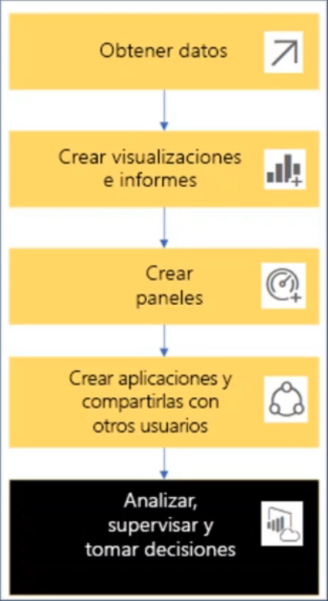

# Indice

# Bloques de Creacion

## Tipos
1. Visualización: Se lo llama a los gráficos creados por diseñadores de Power BI. Los objetos visuales muestran los datos de informes y conjuntos de datos
2. Paneles: es una sola pantalla con gráficos, texto y objetos visuales interactivos. Un panel recopila las métricas mas importantes, en una pantalla, para contrae una historia o responder u a una pregunta.
3. Informes: Es una o mas paginas de gráficos,textos y objetos visuales interactivos que forman un único informe.
4. Aplicaciones: es un recurso de los diseñadores que sirve para agrupar y compartir paneles e informes relacionados entre si.
5. Conjuntos de datos (contenido): es un contenedor de datos. por ejemplo podría ser un archivo de exel de la organización mundial de la salud 

## Flujo de trabajo

# Interface
## Superior
Cada uno lo veremos mas a fondo en su respectivo titulo
### Archivo
Se utiliza para abrir, guarda entre otros: 

### Inicio
En esta hay subPestañas las cuales enumerare de izquierda a derecha
1. Portapapelesv  : Sirve para copiar cortar pegar y copiar formato
2. Datos: Se utiliza para obtener nuestros origenes de datos
3. Consultas: Sirve para copiar nuestras consultas de datos 
4. Insertar: Sirve para colocar objetos visuales
5. Calculos: Nos permitira crear nuevas medidas
6. Caonfidencialidad
7. Compartir: sirve para publicar nuestros datos en la web 

### Insertar
1. Paginas:
2. Elementos Visuales:
3. Objetos Visuales del AI:
4. Power Plataform:
5. Elementos: 

### Modelado
1. Relaciones
2. Calculos
3. Actualizaciones de pagina
4. What if
5. Seguridad
6. Preguntas y respuestas  

### Ver
1. Temas
2. Ajustar al area
3. Mobil
4. Opciones de pagina
5. Mostrar pagina  

## Izquierda
Ordenado de arriba a bajo
1. En la primera podremos ver de forma visual las tablas
2. En el segundo es donde se cargara los datos
3. Donde se administrara las relaciones entre tablas
 

## Derecha
Son opciones visuales de visualisacion de datos
 

## Centro
Donde se visualizan los datos en general
 

# Conexiones
Pawer Bi ofrese diferentes formas de sincronizar los datos. Para ello utilizaremos en la seccion de "inicio", en la pestaña de "datos", la parte de "Obtener datos". 

# Funciones
## Append
Sirve para unir tablas de forma vertical. Para lograrlo hay que seguir los siguientes pasos:
1. En la parte de "inicio" en la seccion de "combinar" tocamos la parte de "anexar consulta" la parte de "anexar consulta para crear una nueva"
2. Al desplegarse la nueva ventana seleccionamos las tablas a anexar, y en la primer tabla seleccionamos la tabla base y en la segunda tabla selecciomaos la tabla a agregar en la base 

## Merge 
Sirve para unir las tablas segunr las claves foraneas. Para lograrlo hay que seguir los siguientes pasos:
1. En la parte de "inicio" en la seccion de "combinar" tocamos la parte de "Conbinar consulta" la parte de "Conbinar consulta para crear una nueva"
2. Al desplegarse la nueva ventana seleccionamos las dos tablas y el valor que se selecciona las claver foraneas.
3. En Tipo de Combinacion se selecciona la forma en al cual queremos que se visualice los datos. 

# Teoria
## Business Intelligence
### Que es?
Es la habilidad para transformar los datos en información y la información en conocimiento, de forma que se pueda optimizar el proceso de toma de decisiones en los negocios

## Power Bi
### Que es? 
Es la herramienta que nos permite unir diferentes fuentes de datos, modernizar y analizar datos para después, presentarlos a través de paneles e informes. Estos mismos después pueden ser consultados de manera fácil y atractiva e intuitiva.