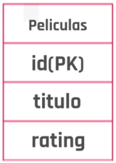
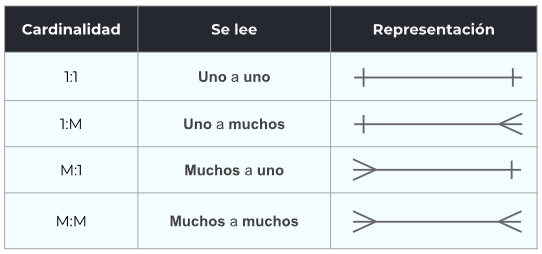

# ¿Que son?
Podemos decir que es un conjunto de datos pertenecientes a un mismo contexto organizados para un propósito específico. Una base de datos nos permite:

- Almacenar (agregar, modificar, eliminar) datos.
- Acceder a los datos.
- Manipular y combinarlos.
- Analizar datos.

# Modelacion 
## Diagrama relacional  
Esta es una abstraccion de la tabla fisica. Te permiten de forma rapida y sencilla visualizar la tabla de nuetra base de datos.
### Rectangulo con titulo
Esta imagen estaria representado una tabla para generos 

### Representacion de los datos
En esta tabla de Peliculas, se puede identificar que tiene ter claves: la clave de id (que es una clave primaria por ese se le representa con el PK y en negrita), la clave de titulo y la clave de rating 

#### clave primaria 
clave unica para la tabla (no se repite el valor dos veces para esa clave)
#### clave foraneas
claves que apunta a claves primarias de otras tablas

### Relaciones

# Relaciones
## Tipos de relaciones
### uno a uno
Un valor se relaciona a otro valor. Por ejemplo un usuairo tiene solo una direccion y una direccion tiene solo un suario
### uno a muchos
Se lo relaciona cuando una tabla se puede relacionar con varias valores de otra tabla pero la tabla relacionada solo a uno. por ejemplo una pelicula tiene solo un genero (uno) pero los generos tiene muchas peliculas (muchos). 
Para este caso se le agrega una columna a peliculas con el id del genero que representan
### muchos a muchos
Se lo relaciona cuando una tambla relaciona varios valores de otra tabla que a su vez este tambien relaciona varios valores como por ejemplo: un actor actua en varias pelicula pero en una pelicula actuan varios actores (muchos a muchos). 
Para representar esto en necesario crear una tabla con las diferentes uniones con un campo id, y los id de los campos relacionados.

# Constraints
Limitaciones para mantener la integridad de nuestra base de datos. Estas estan diferenciadas de la validacion hecha anteriormente.
## tipos
not null    -> esta restriccion no te perimte guardar valores null
unique      -> no se perimte que haya dos filas con el mismo valors
primary key -> identificador de forma unica a una fila (obligatoria)
default     -> aplica un valor por defecto 

