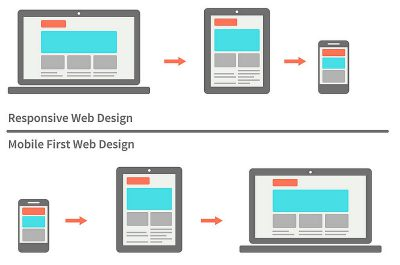
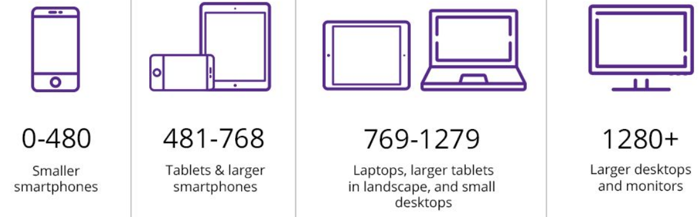
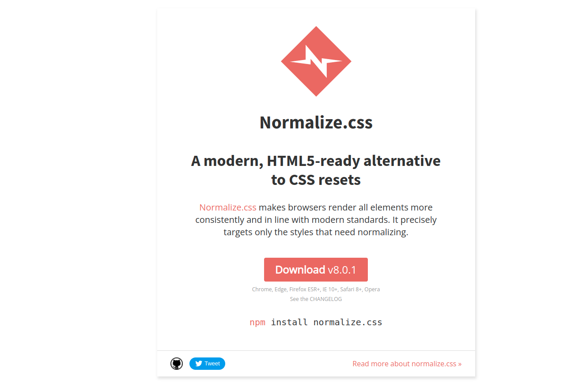

<div id = "indice">

# Indice

1. 
| [Estructuras](#estructuras) |
|:-------------------------:|

2. 
| [Selectores](#selectores) |
|:-------------------------:|
|[universal](#selectores-universal)|
|[etiqueta](#selectores-etiqueta)|
|[objeto](#selectores-objeto)|
|[clase](#selectores-clase)|
|[descendente](#selectores-descendente)|
|[convinada](#selectores-convinada)|
|[id](#selectores-id)|
      

3. 
| [Estilos](#estilos) |
|:-------------------------:|
|[Tipografia](#estilos-Tipografia)|
|[Fodos](#estilos-Fodos)|
|[Bloques](#estilos-Bloques)|
|[Otros](#estilos-Otros)|

4. 
|[Medida](#medida) |
|:-------------------------:|
|[relativa](#medida-relativa)|
|[absolutas](#medida-absolutas)|

5. 
|[MediaQueries](#MediaQueries) |
|:-------------------------:|
|[estructura](#MediaQueries-estructura)|
|[tipos](#MediaQueries-tipos)|
|[breakpoints](#MediaQueries-breakpoints)|

6. 
|[Flex](#flex) |
|:-------------------------:|
|[estructura](#flex-estructura)|
|[ejes](#flex-ejes)|
|[otros](#flex-otros)|

  
7. 
|[Pseudo Selectores](#pseudoSelectores) |
|:-------------------------:|
|[Definicion](#pseudoSelectores-Definicion)|
|[tipos](#pseudoSelectores-tipos)|
|[propiedades](#pseudoSelectores-propiedades)|
  

8. 
|[Posicionamiento](#posicionamiento) |
|:-------------------------:|
|[Mamejo del posicionamiento](#posicionamiento-Mamejo)|
|[profundidad](#posicionamiento-profundidad)|

9. 
|[Animaciones](#animaciones) |
|:-------------------------:|
|[Estructura](#animaciones-Estructura)|
|[Aplicacion](#animaciones-Aplicacion)|

10. 
|[Normalize](#Normalize ) |
|:-------------------------:|

11. 
|[iconos](#iconos ) |
|:-------------------------:|

<br>
<br>
</div>

<div id = "estructuras">

## [indice](#indice)
# Estructuras
    selector{
        propiedad:valor;
        propiedad:valor;
        propiedad:valor;
    }
</div>


<div id = "selectores">

## [indice](#indice)

# Selectores

<div id = "selectores-universal">

## Universal
    *{

    }

</div>
<div id = "selectores-etiqueta">

## Etiqueta
    p{

    }

</div>
<div id = "selectores-objeto">

## objeto
    nombreDelObjeto{

    } 

</div>
<div id = "selectores-clase">


## clase
    .clase{

    } => css
    <h3 class = "nombre de la clase"> </h3> => html

</div>
<div id = "selectores-descendente">

## descendente
    .noticia h2{

    } => css
    <ul id = "noticia">
        <h2> nciwontexto modificadoisoenf </h2>
    </ul>

</div>
<div id = "selectores-convinada ">

## convinada
    h2.noticia => css
    <h2 class = "noticia"> texto modificado </h2>

</div>
<div id = "selectores-id">

## id
    #nombre{

    } => css
    <h3 id = nombre> texto modificado </h3>
</div></div>

<div id = "estilos">

## [indice](#indice)

# Estilos
<div id = "estilos-Tipografia">

## Tipografia
| codigo                    |                                  explicacion                              |    
|:-------------------------:|---------------------------------------------------------------------------|
|`color: color`             |se le pone un color a la tipografia
|`font-famili: tipografia`  |se le pone una tipografia al texto
|`font-size: tamaño px`     |se le agrega un tamaño a la tipografia
|`font-style: italica`      |tipografia en cursiba
|`font-weight: bold`        |tipografia en negrita
|`text-aling: left`         |alineacion left(derecha) right(izquierda) center(centrado) justify(jutificado)
|`text-decoration: none`    |agrega un subrallado (underline) o un tachado (line-through)
|`text-transform: none`     |uppercase(todo en mayuscula), lowercase(todo en minusculas)
|`line-height: tamaño`      |distancia entre parrafos
</div>
<div id = "estilos-Colores">

## Colores
| codigo                                |                   explicacion         |
|:-------------------------------------:|---------------------------------------|
|`color: nombre`                        |aplicar colores con nombre
|`color: porValorHexa`                  |se menciona los 6 digitos hexadecimal
|`color: rgb(rojo,verde,azul)`          |se menciona por rgb
|`color: rgba(rojo,verde,azul,opacidad)`|se le agrega la opacidad al rgb
</div>
<div id = "estilos-Fodos">

## Fodos
| codigo                              |                                 explicacion                                 |
|:-----------------------------------:|-----------------------------------------------------------------------------|
|`background-color: color`            |aplica un fonde de un color determinado
|`background-image: url(ubicacion)`   |se agrega una imange de fondo
|`backgroud-repea: repeat`            |se repite indefinidamente  no-repeat(no repite) y el repeat-y/repeat-x(se repite segun un eje)
|`background-position: center botton` |define la posicion de la imagen
|`background-attachment: scroll`      |scroll(baja segun la pagina) fixed (queda fija)
|`background-size: contain `          |tamaño de la imagen contein(que entre la imagen) cover(ocupe toda la pagina )
</div>
<div id = "estilos-Bloques">

## Bloques
| codigo                      |                                  explicacion                                            |
|:---------------------------:|-----------------------------------------------------------------------------------------|
|display: inline              |cambiar la dispocicion del elemento, block (comportamiento en bloque) inline-block (comportamiento semi-bloque) inline  (comportamiento en linea) none(oculta el elemento)
| `width: valor px`           |se aplica un ancho a
| `height: valor px`          |se le aplica un alto al bloque
| `padding:  valor px`        |se le aplica un espacion de separacion a los costados
| `padding-top: valor px`     |se le aplica un espacio al costado superior
| `padding-right: valor px`   | se le aplica un espacio al costado lateral derecha
| `padding-bottom: valor px`  |se le aplica un espacio al costado inferior
| `padding-left: valor px`    |se le aplica un espacio al costado lateral izquierdo
| `border-width: valor px`    |se le aplica una anchura al borde
| `border-style: valor`       |el tipo de linea que se le aplica al borde solid (continua), dashed(discontinua) dotted(de puntos) double (doble linea continua)
| `border-color: color`       |le aplica un color a la linea
| `border-radius: valor px`   |redondea el borde 
| `margin: valor px`          |le aplica margenes a la caja
| `margin-top: valor px`      |se le aplica un margenes al costado superior
| `margin-right: valor px`    |se le aplica un margenes al costado lateral derecha
| `margin-bottom: valor px`   |se le aplica un margenes al costado inferior
| `margin-left: valor px `    |se le aplica un margenes al costado lateral izquierdo
| `box-sizing: border-box `   |fina los valores de alto y ancho del width y height
</div>
<div id = "estilos-Otros">

## Otros comandos
| codigo            |                       explicacion                             |
|:-----------------:|---------------------------------------------------------------|
|`opacity: valor`   | se le agrega transparencia
|`content: algo`    | se agrega algo al archivo por ejemplo conten: "hola"
|`transition: propiedad tiempo`| se le agrega una trancicion a algun psudocodigo
</div> </div>


<div id = "medida">

## [indice](#indice)

# tipos de medida
<div id = "medida-relativa">

## medida relativa
son aquellas que se modifican segun el contexto alguns ejemplos son:
    % (porsentaje)
    vw (viewport-width)
    vh (viewport-height)
</div>
<div id = "medida-absolutas">

## medidas absolutas
son aquella que no se modifican selgun el contexto algunos ejemplos son:
    px (pixel)
</div> </div>


<div id = "MediaQueries">

## [indice](#indice)
# Media queries
### Es una regla de estilo para que nuestra pagina se vea bien en todas las resoluciones, que se define al final del archivo css

<div id = "MediaQueries-estructura">

## Estructura
    @media(){

    }
    min-width: x px => como minimo (para mobile first)
    max-width x px  => como maximo (para mobile last)
    and (orientation: ) => si se define una orientacion portrait o landscape
</div>
<div id = "MediaQueries-tipos">

## Tipos de forma
mobile first: se empiza por el formato de celular y se va adaptando al modelo de PC (el ma recomendado)
mobile last:  se empieza por el formato de PC a la version de celular 


</div>
<div id = "MediaQueries-breakpoints">

## Breakpoints
Son los puntos recomendados en los cuales hacer un Media queries


</div> </div>


<div id = "flex">

## [indice](#indice)
# flex
<div id = "flex-estructura">

## Estructura basica
    .contenedor{
        displey: flex => hace que los elementos sean flex
        flex-wrap: wrap => matener tamaño de los elementos
    }
</div>
<div id = "flex-ejes">

## Ejes
| codigo                          |explicacion| | | |
|:-------------------------------:|---|---|---|---| 
|`flex-direction: row`            |Eje principal el ancho de izquiera a derecha
|`flex-direction: column `        |Eje principal el largo de arriba a abajo
|`flex-direction: row-reverse`    |Eje principal el ancho de derecha a izquiera
|`flex-direction: column-reverse` |Eje principal el ancho de abajo a arriba
</div>
<div id = "flex-manejo-ejes">

### Manejo de los ejes
#### Main axis (eje X)
| codigo                          |explicacion| | | |
|:-------------------------------:|---|---|---|---| 
|`justify-content: flex-start`    |valor por defecto
|`justify-content: flex-end`      |envia los objetos al final del axis
|`justify-content: center`        |Centra los elementos
|`justify-content: space-between` |Cepara de manera uniforme los objetos
|`justify-content: space-around`  |Cepara de manera uniforme los objetos con separacion al principio y al final

#### Main Cross (eje y)
| codigo                |explicacion| | | |
|:---------------------:|---|---|---|---| 
|`align-items: stretch`   |Se estiran para acabar todo el contenedor
|`align-items: flex-start`|Se alinean al inicio del cross
|`align-items: flex-end ` |Se ubican al final de cross
|`align-items: center`    |Se ubican en el centro
|`align-items: baseline`  |Muestra elementos en la línea base del contenedor (anulana lign-items )
|`align-self: stretch`    |Se estiran para acabar todo el contenedor (anulana lign-items )
|`align-self: flex-start` |Se alinean al inicio del cross (anulana lign-items )
|`align-self: flex-end`   |Se ubican al final de cross (anulana lign-items )
|`align-self: center`     |Se ubican en el centro (anulana lign-items )
|`align-self: baseline`   |Muestra elementos en la línea base del contenedor (anulana lign-items )
</div>
<div id = "flex-otros">

## otros
| codigo                                  |explicacion| | | |
|:---------------------------------------:|---|---|---|---| 
|`flew-flow: <flex-direction> <flex-wrap>`|Convina los dos por ejemplo flew-flow: column warp
|`order: valor`                           |Mueve el elemto al valor pos o neg que se le indeque
|`flex-grow: valor`                       |Agranda un elemento segun el valor que se le indique
</div> </div>


<div id = "pseudoSelectores">

# Grid 
<!------- A COMPLETAR ----->


## [indice](#indice)
# Pseudo selectores

<div id = "pseudoSelectores-Definicion">

## ¿que es?
es diferenciar un comportamiento al momento de pasar por encima del objeto con un cursor
</div>
<div id = "pseudoSelectores-tipos">

## Tipos
### Pseudo clases
    .selector:pseudo-clase{
        codigo
    }
### Pseudo codigo
    hs::pseudo-codigo{
        codigo
    }
</div>
<div id = "pseudoSelectores-propiedades"> 

### propiedades:
| codigo             |explicacion| | | |
|:------------------:|---|---|---|---| 
|`.a:visited{}`      |Cuando un link fue visitado
|`.a:link{}`         |Se le aplican estilos a los enlaces
|`.a:active{}`       |Se le aplican estilos a los enlaces que estan por ser clickeados
|`.selector:hover{}` |Cuando el usuario pase el curso del mouse
|`.selector:focus{}` |Cuando el cursos se ubique dentro del formulario
|`.selector::before` |Se le agrega algo antes del selector
|`.selector::after`  |Se le agrega algo despues del selector
</div> </div>

<div id = "posicionamiento"> 

## [indice](#indice)
# Posicionamiento
`position: propiedad` <br> algunas de las pociciones son: 
| codigo    |explicacion| | | |
|:---------:|---|---|---|---| 
|static     | Posicionamiento normal
|relative   | Posicionamiento en base a la ubicacion del objeto
|absolute   | El contenedor sera el punto de referencia
|fixed      | No importa si se hace scroll el objeto se matiene

<div id = "posicionamiento-Mamejo"> 

## Mamejo del posicionamiento
| codigo             |explicacion| | | |
|:------------------:|---|---|---|---|
|`top:tamaño px`      | movimiento hacia abajo
|`right: tamaño px`   | movimiento hacia la izquierda
|`bottom: tamaño px`  | movimiento hacia arriba
|`left: tamaño px`    | movimiento hacia la derecha
</div>
<div id = "posicionamiento-profundidad"> 

## pocicionamiento en profundidad
| codigo             |explicacion| | | |
|:------------------:|---|---|---|---|
|`z-index: valor`    | se le aplica un valor tanto positivo como negatativo para posicionarlo 
</div> </div>


<div id = "animaciones"> 

## [indice](#indice)
# Animaciones

<div id = "animaciones-Estructura"> 

## Estructura
```
@keyframes nombre{
    0%{ } estado inicial
    100%{ } estado final
}
```
</div>
<div id = "animaciones-Aplicacion"> 

## Aplicacion
| codigo             |explicacion| | | |
|:------------------:|---|---|---|---|
|`animation-name: nombre`                   |aplicar la animacion
|`animation-duration: tiempo`               |tiempo en la cual va a durar la animacion
|`animation-iteration-count: iteraciones`   |cantidad de veces que se repetira la animacion, infinite para no tereminarla
|`animation: nombre tiempo iteranciones`    |es una abreviatura de las tres anteriores 
|`animation-direction: valor`               |valor puede ser: alternative (la animacion va y viene)  normal (la animacion va en bucle)
</div> </div>


<div id = "Normalize">

## [indice](#indice)
# Normalize
## libreria de estilos para web. descarga: 
<a href = "https://necolas.github.io/normalize.css/"> </a>
</div>

<div id = "iconos">

## [indice](#indice)
# Agregar iconos
1. entrar a la pagina de font awesome 
<br>
<a href = "https://fontawesome.com/"> </a>

2. copiar etiqueta del kit para el head
`<script src="https://kit.fontawesome.com/6157b502e6.js" crossorigin="anonymous"></script>`

3. copia el codigo del icomo, algo como esto
`<i class="fa-solid fa-soft-serve"></i>`
</div>